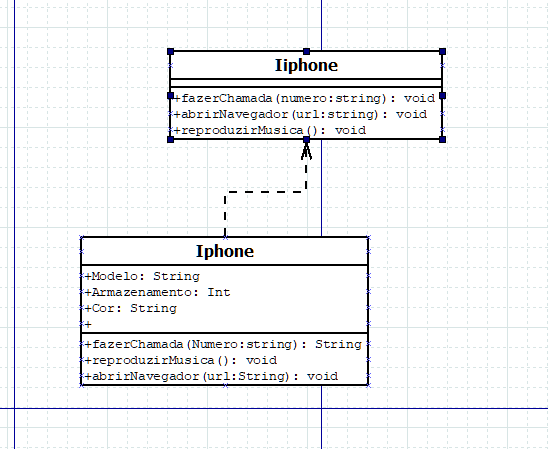

# Classe Iphone com inteface e diagrama uml

Projeto feito para o desafio da Dio

## Interface Iiphone

Onde estao localizados os metodos esperados.

## Entidade Iphone

Criação do modelo do iphone, com atributos de nome, armazenamento e cor.

Implementação dos metodos.

# Diagrama Iphone

Feito no app DIA uml

